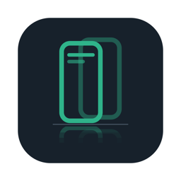

<p align="center"></p>

# ADB Mirror

adb로 연결한 Android 기기 화면을 데스크톱 창에 띄우고, 마우스로 조작하고, 스크린샷을 찍는 도구입니다.

기기 쪽 인코더로 [scrcpy](https://github.com/Genymobile/scrcpy)의 `scrcpy-server`만 사용합니다. 받은 H.264 영상은 macOS의 VideoToolbox로 직접 디코딩해 표시하므로 scrcpy나 FFmpeg를 따로 설치할 필요가 없습니다.

> Kotlin Multiplatform + Compose Multiplatform 앱이 Desktop(macOS·Windows·Linux), Android, Web(Chromium)에서 동작합니다. 처음 만든 macOS용 Swift 프로토타입은 `macos-swift/`에 있습니다. 자세한 내용은 [로드맵](docs/ROADMAP.md)을 참고하세요.

## 기능

- **미러링:** 최대 60fps로 저지연 미러링을 합니다. 기기를 회전하면 창 비율도 따라 바뀝니다.
- **터치:** 클릭은 탭으로, 드래그는 스와이프로 기기에 전달됩니다. `--view-only`를 주면 보기만 합니다.
- **스크린샷:** 기기 원본 해상도 PNG로 찍습니다. ⌘C로 클립보드에 복사하고, ⌘S로 파일에 저장합니다.
- **정리:** 창을 닫으면 adb forward와 기기 쪽 서버를 자동으로 정리합니다.

## 요구사항

- macOS 13 이상, Xcode Command Line Tools(`swift`)
- adb: `PATH`, `ANDROID_HOME`/`ANDROID_SDK_ROOT`, `~/Library/Android/sdk` 순서로 찾습니다.
- Android 5.0 이상 기기에서 USB 디버깅이 켜져 있어야 합니다.

## 실행 (macOS Swift 프로토타입)

```bash
git clone https://github.com/eoeo0326/adb-mirror.git
cd adb-mirror/macos-swift
./run.sh                          # 연결된 첫 기기
./run.sh -s <serial> --view-only  # 기기 지정, 보기 전용
```

`run.sh`는 처음 실행할 때 `scrcpy-server`를 받아 sha256을 검증하고, 빌드한 뒤 실행합니다. Finder에서 `macos-swift/ADB Mirror.command`를 더블클릭해도 됩니다.

수동으로 빌드하려면 레포 루트에서 다음과 같이 합니다.

```bash
./scripts/fetch-server.sh
cd macos-swift
swift build -c release
.build/release/adb-mirror
```

## KMP 앱 (Desktop·Android·Web)

Kotlin Multiplatform + Compose Multiplatform 버전입니다. Desktop에서 기기 선택 → 미러링 → 터치, 클릭 이펙트, 스크린샷, MP4 녹화, GIF·WebP 변환, 설정 저장까지 됩니다. macOS·Windows·Linux 설치 파일과 포터블은 [Releases](https://github.com/eoeo0326/adb-mirror/releases)에서 받을 수 있습니다.

직접 빌드하려면 JDK 21과 Android SDK(compileSdk 37)가 필요하고, scrcpy-server는 빌드할 때 Gradle이 받아 옵니다.

```bash
./gradlew :composeApp:run                         # Desktop
./gradlew :androidApp:installDebug                # Android
./gradlew :composeApp:wasmJsBrowserDevelopmentRun # Web
./gradlew allTests                                # 공통 테스트
./gradlew :core:data:jvmTest -Padbmirror.device=<serial>  # 실기기 통합 테스트
ADB_MIRROR_STATS=1 ./gradlew :composeApp:run      # 초당 디코딩 프레임 수 출력
ADB_MIRROR_HWDECODE=0 ./gradlew :composeApp:run   # 하드웨어 디코딩 끄기(비교·문제 확인용)
ADB_MIRROR_GPU_YUV=0 ./gradlew :composeApp:run    # GPU YUV 그리기 끄기(BGRA로 그림)
scripts/measure-cpu.sh <serial> 10                # 스크롤하며 10초간 CPU 평균·최대
```

### macOS에서 처음 열기

Apple 개발자 서명·공증을 하지 않은 앱이라, Releases에서 받은 앱을 처음 열면 "확인되지 않은 개발자" 경고가 뜨고 열리지 않습니다. 아래 둘 중 한 가지를 한 번만 하면 그다음부터는 바로 열립니다.

- 앱을 한 번 열어 경고를 닫은 뒤, 시스템 설정 → 개인정보 보호 및 보안 아래쪽의 "그래도 열기"를 누르고 암호를 입력합니다.
- 터미널에서 다운로드 표시(격리 속성)를 지웁니다.

  ```bash
  xattr -dr com.apple.quarantine "/Applications/ADB Mirror.app"
  ```

macOS 14 이하에서는 Finder에서 앱을 우클릭 → 열기로도 열 수 있습니다. macOS 15부터는 이 방법이 없어졌습니다.

### Android 앱

다른 기기(또는 이 폰 자신)에 무선 디버깅(Android 11+)으로 붙어 미러링합니다. USB 케이블이나 PC가 필요 없습니다.

1. 미러링할 기기에서 설정 > 개발자 옵션 > 무선 디버깅을 켭니다.
2. 처음 한 번은 페어링합니다.
   - 다른 기기: 그 기기에서 "페어링 코드로 기기 페어링"을 열고, 앱에 코드를 입력해 페어링합니다. 같은 Wi-Fi면 페어링 포트가 자동으로 채워집니다.
   - 이 폰 자신: "알림으로 이 폰 페어링"을 누르고, 열린 설정에서 페어링 창을 띄운 채 코드를 알림 답장으로 입력합니다.
3. "이 네트워크에서 찾음" 목록에서 기기를 누르면 연결됩니다. 연결했던 기기는 다음 실행 때 자동으로 다시 연결합니다(무선 디버깅을 다시 켜 포트가 바뀌어도 찾아서 연결).
4. 기기를 고르고 "미러링 시작"을 누릅니다. 메뉴에서 스크린샷 복사·저장, 녹화, GIF·WebP 변환을 할 수 있습니다.

저장 위치는 스크린샷·GIF·WebP가 `Pictures/ADB Mirror`, 녹화가 `Movies/ADB Mirror`입니다. 저장소 권한은 필요 없습니다. Android 9 이하는 앱 전용 폴더(`Android/data/…`)에 저장합니다.

### Web 앱

Chrome·Edge 같은 Chromium 브라우저가 WebUSB로 기기에 직접 붙습니다. adb나 다른 프로그램을 설치하지 않아도 됩니다. 페이지는 https 또는 localhost에서 열어야 합니다.

```bash
./gradlew :composeApp:wasmJsBrowserDistribution   # composeApp/build/dist/wasmJs/productionExecutable/
python3 -m http.server -d composeApp/build/dist/wasmJs/productionExecutable 8080   # http://localhost:8080
```

1. 기기의 USB 디버깅을 켜고 케이블로 연결합니다. 이 컴퓨터에서 adb 서버가 돌고 있으면 USB를 차지하므로 `adb kill-server`로 끕니다.
2. "USB 기기 연결"을 누르고 브라우저 창에서 기기를 고릅니다. 처음이면 기기에서 "USB 디버깅 허용"을 누릅니다.
3. 기기를 고르고 "미러링 시작"을 누릅니다. 영상은 WebCodecs로 그리고, 클릭·드래그는 터치로 보냅니다.
4. 스크린샷 복사는 클립보드, 저장과 녹화(MP4)는 브라우저 다운로드로 받습니다. GIF·WebP 변환은 Desktop·Android에서만 됩니다.

브라우저의 adb 키는 이 사이트의 localStorage에 둡니다. 기기에서 "항상 허용"한 키라서, 공용 컴퓨터에서는 사이트 데이터를 지우세요.

### 설치 파일 만들기

설치 파일은 그 OS에서만 만들 수 있습니다(크로스 빌드 안 됨). macOS는 빌드하는 Mac의 아키텍처(arm64·x64)용으로 만들어집니다.

| OS | 명령 | 결과 (`composeApp/build/compose/binaries/main/`) |
|---|---|---|
| macOS | `./gradlew :composeApp:packageDmg` | `dmg/ADB Mirror-<버전>.dmg` |
| Windows | `./gradlew :composeApp:packageMsi` | `msi/ADB Mirror-<버전>.msi` (사용자 단위 설치, 관리자 권한 불필요) |
| Linux | `./gradlew :composeApp:packageDeb` · `packageRpm` | `deb/`, `rpm/` (`adb-mirror`) |

- `./gradlew :composeApp:packageDistributions`는 이 OS의 설치 파일과 포터블 배포본을 `composeApp/build/release/`에 `ADB-Mirror-<버전>-<os>-<arch>.<확장자>` 이름으로 모읍니다.
  - 포터블: Windows `…-portable.zip`, Linux `…-portable.tar.gz`. 풀어서 바로 실행하고, 설정은 풀린 폴더의 `data/`에 저장됩니다(`portable` 파일을 지우면 설치형처럼 사용자 폴더에 저장). macOS는 앱 번들 안에 쓸 수 없어 포터블을 만들지 않습니다.
- 버전은 `gradle.properties`의 `appVersion`(MAJOR.MINOR.PATCH)입니다. macOS 패키지는 첫 숫자가 0이면 만들 수 없어서, 1.0 전까지는 macOS 패키지 버전만 첫 숫자를 1로 씁니다(0.3.0 → 1.3.0).
- 아직 Apple 개발자 서명·공증을 하지 않아 ad-hoc 서명으로 만듭니다. 받은 앱을 여는 방법은 [macOS에서 처음 열기](#macos에서-처음-열기)를 보세요.

### CI와 릴리즈

[GitHub Actions](.github/workflows/build.yml)가 PR·main 푸시마다 테스트를 돌리고, macOS(arm64·x64)·Windows x64·Linux(x64·arm64)에서 설치 파일과 포터블을 만듭니다. `v*` 태그를 올리면 그 파일들과 `SHA256SUMS`를 GitHub Release에 올립니다(릴리즈가 없으면 CHANGELOG의 해당 버전 절로 만듭니다).

macOS 서명·공증은 저장소 Secrets에 아래 값이 있을 때만 합니다. 없으면 ad-hoc 서명으로 만듭니다.

| Secret | 내용 |
|---|---|
| `MACOS_CERTIFICATE` | Developer ID Application 인증서(.p12)를 base64로 |
| `MACOS_CERTIFICATE_PASSWORD` | .p12 암호 |
| `MACOS_SIGNING_IDENTITY` | 예: `Developer ID Application: 이름 (TEAMID)` |
| `APPLE_ID` · `APPLE_APP_PASSWORD` · `APPLE_TEAM_ID` | 공증용 Apple ID, 앱 암호, 팀 ID |

### 설정 파일 위치

설정(해상도·fps·토글·저장 폴더·adb 경로)은 `settings.properties`에 저장됩니다.

| 환경 | 위치 |
|---|---|
| macOS | `~/Library/Application Support/ADB Mirror/` |
| Windows | `%APPDATA%\ADB Mirror\` |
| Linux | `$XDG_CONFIG_HOME/adb-mirror/` (없으면 `~/.config/adb-mirror/`) |
| 포터블 | 실행 파일 폴더(Linux는 `bin/`의 상위)에 `portable` 파일이 있으면 그 옆 `data/` |

개발 중에는 `ADB_MIRROR_DATA_DIR=<폴더>`로 위치를 바꿀 수 있습니다.

## 구조

```
core/domain      모델 · Repository 인터페이스 · UseCase (순수 Kotlin)
core/adb         AdbTransport 인터페이스와 플랫폼별 구현
core/data        scrcpy 프로토콜 · Repository 구현
feature/mirror   MVI 화면 (Compose)
composeApp       공유 앱 + Desktop · Web 진입점
androidApp       Android 앱 진입점
macos-swift/     Swift 프로토타입 (KMP 버전이 같은 기능을 갖출 때까지 유지)
scripts/         scrcpy-server 다운로드, fixture 캡처
fixtures/        파서 테스트용 실제 스트림
```

## 옵션

| 옵션 | 설명 |
|---|---|
| `-s, --serial SERIAL` | 대상 기기 (기본: 연결된 첫 기기) |
| `--max-size PX` | 긴 변 최대 픽셀 (기본 1280, 0이면 원본) |
| `--fps N` | 최대 프레임레이트 (기본 60) |
| `--view-only` | 터치를 보내지 않음 |
| `--screenshot-dir DIR` | ⌘S 저장 폴더 (기본 `~/Desktop`) |
| `--stats` | 1초마다 표시 fps와 디스플레이 레이어 상태 출력 |

## 단축키

| 키 | 동작 |
|---|---|
| ⌘C | 스크린샷을 클립보드에 PNG로 복사 |
| ⌘S | 스크린샷을 `<serial>_yyyyMMdd_HHmmss.png`로 저장 |
| ⌘Q | 종료 (창 닫기, Ctrl+C도 같음) |

## 동작 원리

```
[Android]  scrcpy-server (MediaCodec H.264 인코딩)
     │  localabstract:scrcpy_<scid>
     │  adb forward tcp:<port>
[Mac]      영상 소켓 → scrcpy v4 프로토콜 파싱 → Annex B→AVCC → AVSampleBufferDisplayLayer
           컨트롤 소켓 ← 마우스 이벤트를 INJECT_TOUCH_EVENT로 직렬화
           adb exec-out screencap -p → 스크린샷 PNG
```

- scrcpy는 화면이 바뀔 때만 프레임을 보냅니다. 그래서 정지 화면에서는 `--stats`가 fps=0으로 나오는 것이 정상입니다.
- 서버와 클라이언트 프로토콜은 버전 간 호환되지 않습니다. `scripts/fetch-server.sh`의 `VERSION`과 `macos-swift/Sources/adb-mirror/ScrcpyServer.swift`의 `serverVersion`은 항상 함께 바꿔야 합니다.

## 로드맵

KMP/CMP로 옮기는 작업은 Phase 0~4로 나눠 [GitHub Milestones](https://github.com/eoeo0326/adb-mirror/milestones)에서 관리합니다. 요약은 [docs/ROADMAP.md](docs/ROADMAP.md)에 있습니다.

## 아이콘

`assets/icon/`에 원본 SVG와 여러 크기의 PNG(16~1024px), macOS용 `AppIcon.icns`, Windows용 `icon.ico`가 있습니다. 겹친 두 폰은 원본과 미러링된 화면을, 아래의 옅은 비침은 거울을 나타냅니다.

macOS 26 이상은 Icon Composer 원본 `assets/icon/AppIcon.icon`을 컴파일한 `packaging/macos/Resources/Assets.car`를 씁니다(없으면 아이콘이 흰 판 위에 작게 보입니다). 원본을 고친 뒤에는 Xcode 26이 있는 Mac에서 `scripts/build-mac-icon.sh`로 다시 만들어 함께 커밋하세요. 빌드와 CI에는 Xcode가 필요 없습니다.

## 라이선스

[Apache License 2.0](LICENSE). 이 레포에는 `scrcpy-server` 바이너리가 들어 있지 않습니다. 빌드할 때 Genymobile/scrcpy 릴리즈에서 받아 씁니다. 고지 사항은 [NOTICE](NOTICE)를 참고하세요.
